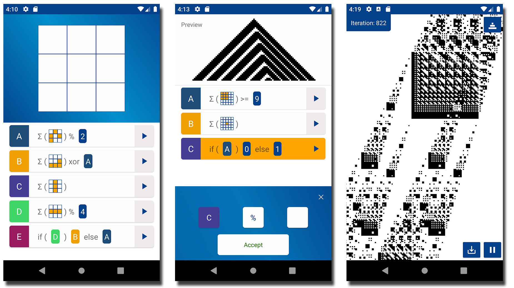
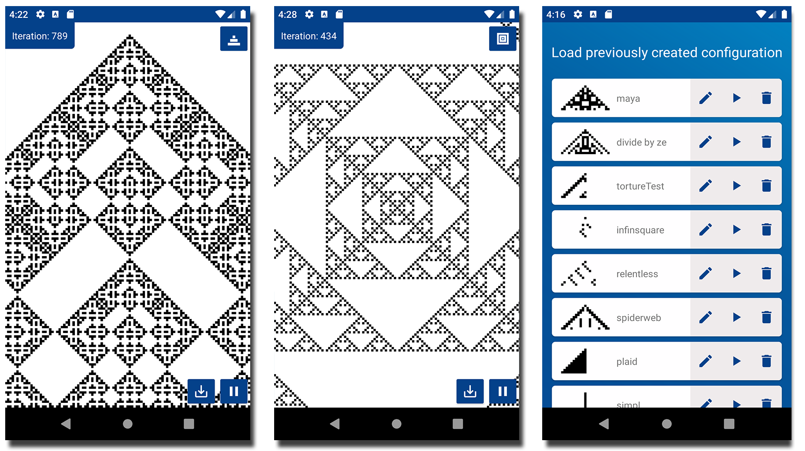
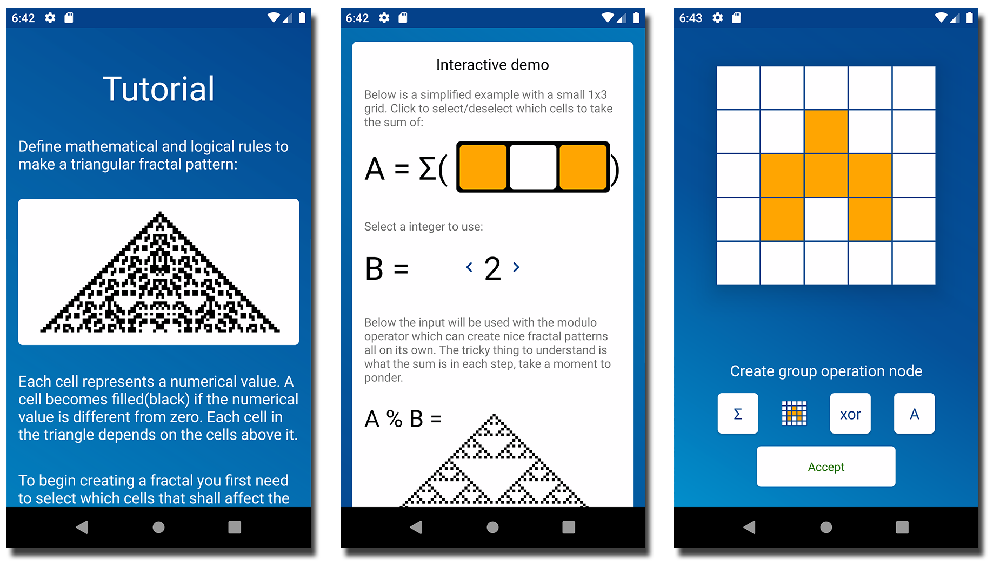

# FractalView

App to facilitate fractal exploration urges.

Imagine, create and explore fractals through mathematical formulas.

Noew on google play: https://play.google.com/store/apps/details?id=se.admdev.fractalviewer

Small TODO list for what would be good improve:

1. Fix pinch to zoom
2. Fix inline mode not looking balanced when making an if-conditional-node
3. Make sure there is no race condition in the thread handling
4. Optimize the fractal generators to not use so much memory
5. Improve the ancestor edit grid to always be dividable by the number of squares
6. Add remove node feature
7. Maybe add a flourish animation to start page
9. Get starting seed for pyramid from core/ user configurable
10. Credit https://shapeshifter.design/ for being a nice tool in third party credit
11. Reproduce bug which made inline edit controls disappear once after i implemented landscape mode animation
12. Fix tutorial miniature blink in
13. Rewrite drawing in OpenGL
14. Add edit node feature
15. Link to operator glossary from compact picker
16. Add proper accept button when selecting free text operands
17. Fix missing space before parentheses in interactive demo
